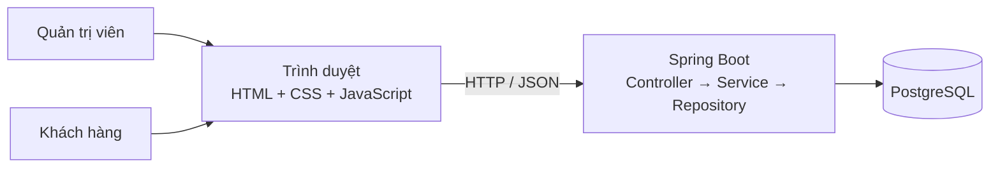
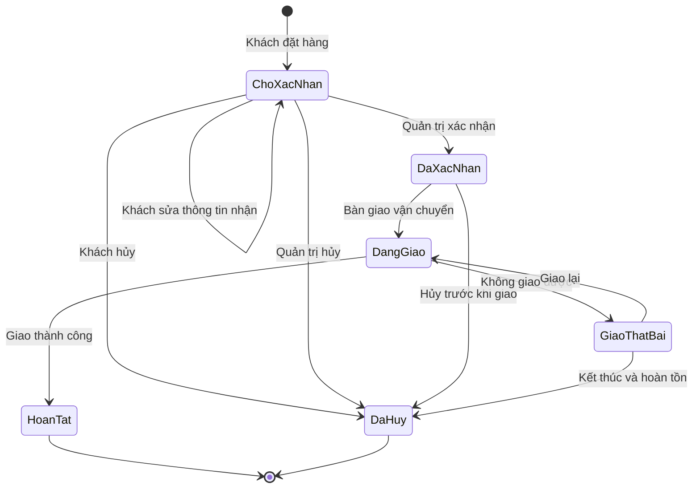
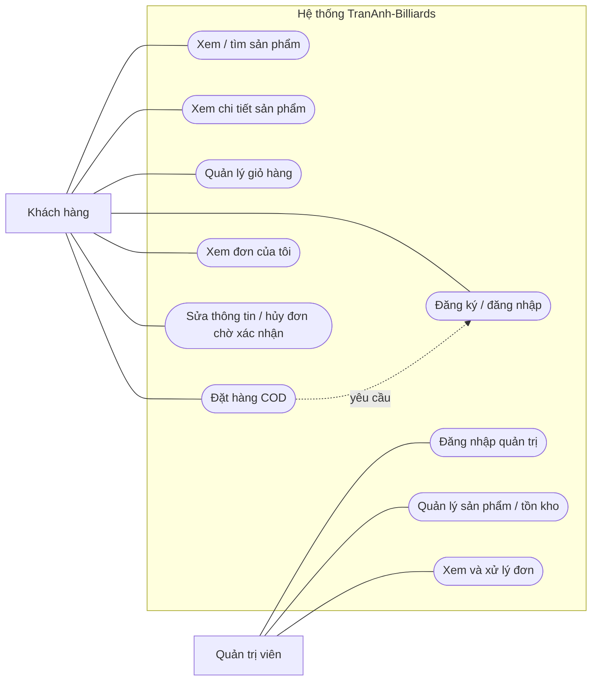
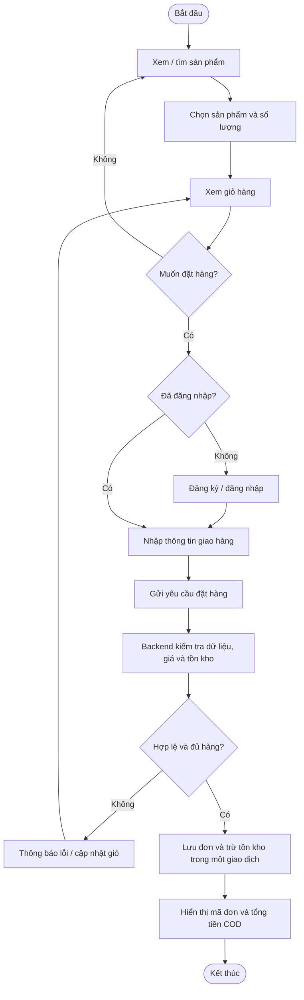
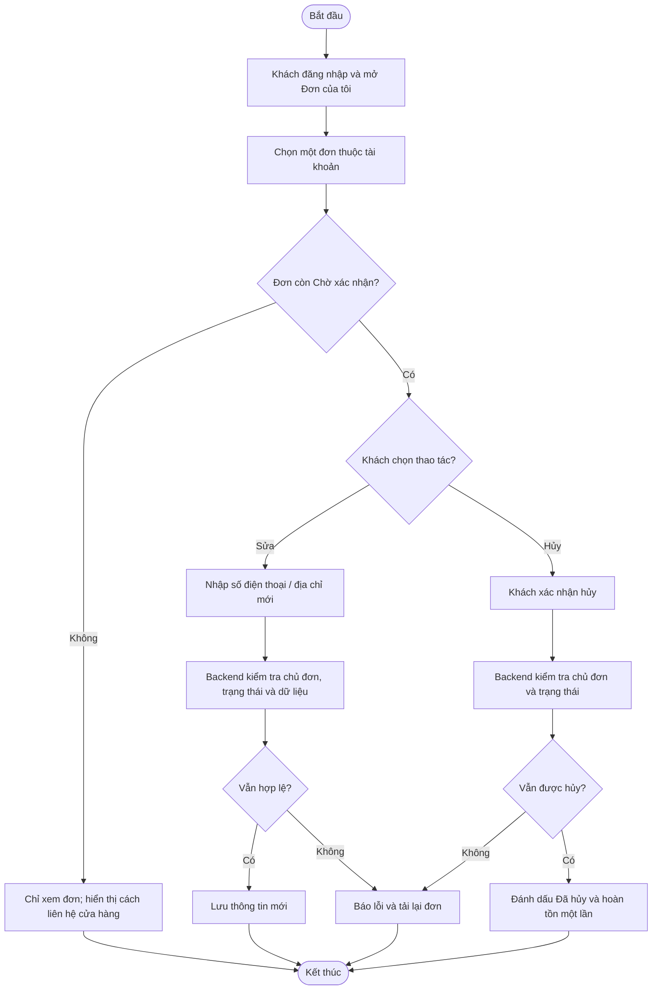
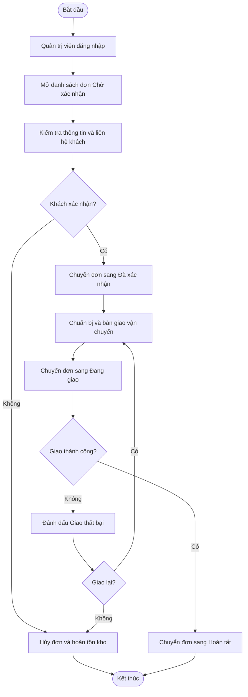

# TranAnh-Billiards — Định hướng kỹ thuật và nghiệp vụ phiên bản 1

Tài liệu này là bản thiết kế để học và thảo luận trước khi viết mã. Chưa có giao diện, API hay cơ sở dữ liệu được triển khai.

## 1. Quyết định công nghệ

| Thành phần | Lựa chọn | Vai trò |
| --- | --- | --- |
| Giao diện | HTML, CSS, JavaScript thuần | Dựng trang, tương tác với người dùng, gọi API bằng `fetch` |
| Backend | Java 25 LTS, Spring Boot 4.1.x, Spring MVC | Xử lý nghiệp vụ và cung cấp API JSON |
| Dữ liệu | PostgreSQL | Lưu sản phẩm, danh mục, tài khoản khách và quản trị, đơn hàng |
| Truy cập dữ liệu | Spring Data JPA | Ánh xạ đối tượng Java với bảng dữ liệu |
| Xác thực và phân quyền | Spring Security, đăng nhập bằng phiên | Khách chỉ quản lý đơn của mình; quản trị viên quản lý cửa hàng |
| Quản lý dự án Java | Maven | Quản lý thư viện, biên dịch và chạy ứng dụng |

Giao diện HTML/CSS/JS sẽ được Spring Boot phục vụ cùng tên miền với API `/api/...`. Cách bố trí này giữ dự án gọn và giúp JavaScript gọi API bằng đường dẫn tương đối. Giỏ hàng tạm thời lưu trong trình duyệt; đơn hàng thực sự chỉ được tạo sau khi backend kiểm tra lại giá và tồn kho.

Không dùng React, Next.js hoặc cổng thanh toán cho phiên bản đầu. **Đã chốt tài khoản khách hàng**. Khách có thể xem sản phẩm khi chưa đăng nhập; để đặt hàng và quản lý đơn, khách phải đăng nhập. Đây là lựa chọn đơn giản nhất để mỗi đơn gắn với đúng một tài khoản trong phiên bản 1.

### Kiến trúc tổng quát

### Tài liệu công nghệ

- [Yêu cầu hệ thống của Spring Boot](https://docs.spring.io/spring-boot/system-requirements.html)
- [Spring MVC và API JSON](https://docs.spring.io/spring-boot/how-to/spring-mvc.html)
- [Spring Data JPA](https://docs.spring.io/spring-data/jpa/reference/)
- [Phân quyền URL trong Spring Security](https://docs.spring.io/spring-security/reference/servlet/authorization/authorize-http-requests.html)
- [Fetch API của trình duyệt](https://developer.mozilla.org/en-US/docs/Web/API/Fetch_API/Using_Fetch)

## 2. Gợi ý cách nhận đơn

| Phương án | Ưu điểm | Điều cần xử lý | Đề xuất |
| --- | --- | --- | --- |
| Đặt hàng rồi cửa hàng liên hệ lại | Rất nhanh để bắt đầu | Khách chưa biết chắc đơn và số tiền phải trả | Chỉ dùng nếu mục tiêu là lấy liên hệ |
| COD — trả tiền khi nhận hàng | Luồng đặt hàng đầy đủ, chưa cần kết nối cổng thanh toán | Cần xác nhận đơn và quản lý giao hàng thủ công | **Đã chốt cho phiên bản 1** |
| Chuyển khoản thủ công | Có thể nhận tiền trước | Phải đối soát giao dịch, xử lý đơn chưa thanh toán và hoàn tiền | Thêm sau COD |
| Cổng thanh toán trực tuyến | Thanh toán tự động hơn | Tích hợp, kiểm thử và xử lý hoàn tiền phức tạp hơn | Giai đoạn sau |

**Đã chốt:** thanh toán COD và tài khoản khách hàng cho phiên bản 1. **Cần chốt tiếp:** cách tính phí vận chuyển. Các sơ đồ đang giả định một mức phí cố định do cửa hàng cấu hình.

### Khách quản lý đơn sau khi đặt

Khách đăng ký và đăng nhập, sau đó xem danh sách và chi tiết những đơn thuộc tài khoản mình. Backend lấy danh tính từ phiên đăng nhập và kiểm tra quyền sở hữu đơn; mã đơn hoặc số điện thoại không đủ để cấp quyền sửa/hủy.

| Trạng thái đơn | Khách được làm gì? |
| --- | --- |
| Chờ xác nhận | Xem đơn, tự đổi số điện thoại/địa chỉ nhận, tự hủy đơn |
| Đã xác nhận | Xem đơn; liên hệ cửa hàng để yêu cầu thay đổi hoặc hủy trước khi bàn giao vận chuyển |
| Đang giao / Giao thất bại | Xem đơn; liên hệ cửa hàng để xử lý theo tình trạng thực tế |
| Hoàn tất / Đã hủy | Xem lịch sử đơn |

Với phiên bản 1, thay đổi trực tiếp chỉ mở khi đơn **Chờ xác nhận**. Backend sẽ kiểm tra lại trạng thái ngay lúc lưu thay đổi; giao diện ẩn nút là chưa đủ. Phương án đăng nhập dự kiến là **email và mật khẩu**; cần xác nhận email có phù hợp với khách hàng mục tiêu không trước khi lập trình phần tài khoản.

## 3. Phạm vi nghiệp vụ phiên bản 1

### Vai trò

- **Khách hàng:** xem, tìm kiếm, chọn sản phẩm; đăng ký/đăng nhập để đặt hàng và quản lý đơn của mình.
- **Quản trị viên:** đăng nhập, quản lý sản phẩm và xử lý đơn hàng.

### Dữ liệu chính

| Đối tượng | Thông tin tối thiểu |
| --- | --- |
| Danh mục | Mã, tên, trạng thái |
| Sản phẩm | Mã, tên, danh mục, giá, số lượng tồn, mô tả, ảnh, trạng thái hiển thị |
| Thuộc tính cơ | Thương hiệu, chiều dài, trọng lượng, loại đầu cơ, chất liệu; bổ sung theo sản phẩm thực tế |
| Tài khoản khách | Mã, email đăng nhập duy nhất, mật khẩu được băm, tên, số điện thoại |
| Đơn hàng | Mã, tên/số điện thoại/địa chỉ người nhận, phí giao hàng, tổng tiền, trạng thái, thời điểm đặt |
| Dòng đơn hàng | Sản phẩm, số lượng, đơn giá tại lúc đặt, thành tiền |
| Tài khoản quản trị | Tên đăng nhập, mật khẩu được băm, vai trò |

### Quy tắc nghiệp vụ

1. Chỉ sản phẩm đang hiển thị mới có thể được đặt mua. Sản phẩm hết hàng có thể vẫn xuất hiện nhưng không cho thêm vào đơn.
2. Số lượng mua phải lớn hơn 0 và không vượt số lượng tồn tại thời điểm đặt hàng.
3. Backend tự đọc lại giá và tồn kho, tính tổng tiền; không tin giá hoặc tổng tiền gửi từ trình duyệt.
4. Khi tạo đơn hợp lệ, hệ thống trừ tồn kho và lưu đơn cùng các dòng đơn trong một giao dịch. Nếu tạo đơn thất bại, tồn kho không thay đổi.
5. Đơn lưu lại tên và đơn giá sản phẩm tại thời điểm mua để lịch sử không đổi khi quản trị viên sửa sản phẩm.
6. Đơn mới có trạng thái **Chờ xác nhận**. Quản trị viên có thể xác nhận hoặc hủy. Nếu hủy trước khi giao, số lượng đã trừ được hoàn lại đúng một lần.
7. Để đặt hàng, khách phải đăng nhập. Đơn được gắn với tài khoản đang đăng nhập; backend không nhận `customerId` từ trình duyệt làm căn cứ phân quyền.
8. Thông tin người nhận bắt buộc gồm họ tên, số điện thoại và địa chỉ giao hàng. Backend phải kiểm tra dữ liệu đầu vào.
9. Khách chỉ xem và quản lý đơn của mình. Khi đơn còn **Chờ xác nhận**, khách có thể sửa số điện thoại/địa chỉ giao hàng hoặc hủy; hủy đơn phải hoàn tồn kho đúng một lần.
10. Chỉ quản trị viên được quản lý sản phẩm, tồn kho và chuyển đơn sang các trạng thái xử lý sau khi xác nhận.

### Vòng đời đơn hàng

Trường hợp **Giao thất bại** cần quyết định cách xử lý thực tế của cửa hàng trước khi triển khai; sơ đồ đang để hai đường: giao lại hoặc hủy đơn và hoàn tồn.

## 4. Use case

Sơ đồ dưới đây cho thấy các hành động của mỗi vai trò trong hệ thống. Phần mô tả bên dưới quy định điều kiện và kết quả của các ca quan trọng.

| Mã | Use case | Điều kiện trước | Kết quả thành công | Ngoại lệ chính |
| --- | --- | --- | --- | --- |
| UC-01 | Xem / tìm sản phẩm | Không cần đăng nhập | Nhìn thấy sản phẩm đang hiển thị | Không có kết quả thì hiện thông báo |
| UC-02 | Quản lý giỏ hàng | Sản phẩm tồn tại | Thêm, đổi số lượng, xóa sản phẩm trong giỏ | Hết hàng hoặc số lượng không hợp lệ |
| UC-03 | Đăng ký / đăng nhập | Có email chưa dùng để đăng ký | Có tài khoản và phiên đăng nhập | Email trùng, thông tin sai, mật khẩu sai |
| UC-04 | Đặt hàng COD | Đã đăng nhập, giỏ có hàng, có thông tin giao hàng | Có mã đơn thuộc tài khoản và trạng thái Chờ xác nhận | Dữ liệu sai, sản phẩm ngừng bán, thiếu tồn kho |
| UC-05 | Xem đơn của tôi | Đã đăng nhập | Thấy danh sách và chi tiết đơn của chính mình | Đơn không thuộc tài khoản thì không được truy cập |
| UC-06 | Sửa thông tin / hủy đơn | Đã đăng nhập; đơn thuộc tài khoản và Chờ xác nhận | Thông tin được cập nhật hoặc đơn bị hủy, hoàn tồn | Đơn đã xác nhận hoặc bị người khác sửa đồng thời |
| UC-07 | Quản lý sản phẩm | Quản trị viên đã đăng nhập | Tạo, sửa, ẩn sản phẩm và cập nhật tồn | Dữ liệu sai hoặc không có quyền |
| UC-08 | Xử lý đơn | Quản trị viên đã đăng nhập, đơn tồn tại | Chuyển trạng thái hợp lệ | Chuyển trạng thái sai hoặc xử lý trùng |

## 5. Sơ đồ hoạt động

### 5.1. Khách đặt hàng COD

### 5.2. Khách sửa hoặc hủy đơn Chờ xác nhận

### 5.3. Quản trị xử lý đơn

## 6. Thứ tự triển khai để học

Mỗi chặng có một phần nhỏ chạy được. Ta chỉ chuyển chặng khi bạn hiểu đường đi của dữ liệu và tự kiểm tra được kết quả.

| Chặng | Bạn học và tự làm | Kết quả cần kiểm tra |
| --- | --- | --- |
| 1. Bộ khung | Tạo dự án Java bằng Maven, chạy Spring Boot, tạo một trang HTML với CSS và JS trong thư mục tài nguyên tĩnh. Viết một API JSON đơn giản và gọi nó bằng `fetch`. | Mở trang trên trình duyệt, thấy dữ liệu do API Java trả về; giải thích được request và response. |
| 2. Dữ liệu sản phẩm | Vẽ quan hệ Danh mục–Sản phẩm, tạo bảng PostgreSQL, tạo `Entity`, `Repository`, `Service`, `Controller`. Làm API danh sách và chi tiết sản phẩm. | Thêm sản phẩm trong DB thì trang hiển thị; sản phẩm bị ẩn không xuất hiện với khách. |
| 3. Trang bán hàng | Dựng trang chủ, danh mục, chi tiết. Viết JS gọi API, xử lý trạng thái tải, lỗi và danh sách rỗng. | Xem được sản phẩm trên điện thoại và máy tính, kể cả khi API lỗi hoặc không có hàng. |
| 4. Tài khoản khách | Thiết kế bảng tài khoản; làm đăng ký, đăng nhập, đăng xuất, băm mật khẩu và phân quyền bằng Spring Security. | Khách đăng nhập được; người chưa đăng nhập không thể đặt hàng; tài khoản A không thể truy cập dữ liệu của B. |
| 5. Giỏ hàng | Lưu sản phẩm và số lượng trong trình duyệt; tính tổng tạm tính để hiển thị. | Tải lại trang vẫn còn giỏ; thay đổi số lượng và xóa sản phẩm được. |
| 6. Đặt hàng COD | Tạo biểu mẫu giao hàng, API tạo đơn gắn với tài khoản đang đăng nhập; kiểm tra lại giá/tồn kho, lưu đơn và trừ tồn trong một giao dịch. | Đơn hợp lệ xuất hiện trong tài khoản; nhập sai hoặc thiếu hàng không tạo đơn và không trừ tồn. |
| 7. Khách quản lý đơn | Làm trang Đơn của tôi, chi tiết đơn, sửa thông tin giao hàng và hủy khi Chờ xác nhận. | Tài khoản A không thể xem đơn của B; đơn đã xác nhận không thể sửa/hủy trực tiếp. |
| 8. Quản trị | Thêm vai trò quản trị; làm trang quản lý sản phẩm và chuyển trạng thái đơn. | Khách không mở được API quản trị; quản trị viên cập nhật đơn theo đúng vòng đời. |
| 9. Kiểm thử và đưa vào dùng | Thử toàn bộ luồng, đặc biệt hai khách đặt món hàng cuối cùng, hủy đơn hoàn tồn, dữ liệu nhập sai và giao diện di động; sau đó triển khai. | Các quy tắc nghiệp vụ giữ đúng trong các tình huống thường gặp và tình huống lỗi. |

Ví dụ ở chặng 2, đường đi của dữ liệu là **PostgreSQL → Repository → Service → Controller → JSON → `fetch` → HTML**. Ở chặng 6, đường đi ngược lại từ biểu mẫu tới API và cơ sở dữ liệu. Ta sẽ đi từng lớp một, không viết toàn bộ các lớp trong một lần.

## 7. Việc làm ngay tiếp theo

**Bài thực hành đầu tiên: chặng 1 — kết nối một trang HTML với một API Java.** Chưa cần PostgreSQL, sản phẩm thật hoặc giao diện cửa hàng hoàn chỉnh.

1. Dùng [Spring Initializr](https://start.spring.io/) để tạo dự án **Maven, Java, Spring Boot 4.1.x, Java 25, JAR**, `group` là `com.trananhbilliards`, `artifact` là `trananh-billiards`; chỉ chọn dependency **Spring Web** lúc này.
2. Giải nén dự án vào thư mục làm việc, giữ `docs/` hiện có. Chạy ứng dụng bằng Maven Wrapper đi kèm dự án (`.\mvnw.cmd spring-boot:run` trên Windows).
3. Tự tạo API `GET /api/hello` trả JSON có lời chào. Tự tạo `index.html`, một tệp CSS và một tệp JS; JS dùng `fetch('/api/hello')` rồi đưa lời chào vào trang.
4. Tự kiểm tra: mở được trang qua ứng dụng Spring Boot, thấy lời chào từ API; nếu API không chạy thì trang hiện một thông báo lỗi dễ hiểu.

Sau bài này, hãy giải thích lại bằng lời: trình duyệt gửi yêu cầu nào, `Controller` trả gì, JSON được JavaScript chuyển thành nội dung HTML như thế nào. Có thể đối chiếu với [hướng dẫn REST chính thức của Spring](https://spring.io/guides/gs/rest-service/).

Trước khi tới chặng tài khoản và đặt hàng, cần chốt thêm **email hay số điện thoại dùng để đăng nhập** và **cách tính phí vận chuyển**.

